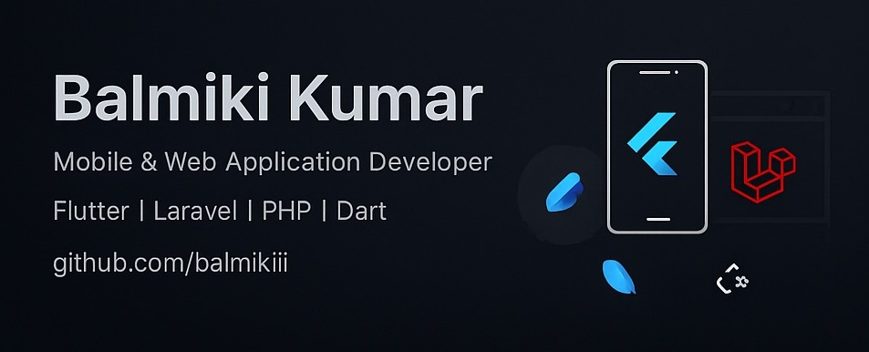

  

<!-- <h1 align="center">👋 Hi, I'm Balmiki Kumar</h1>

  <b>Mobile & Web Application Developer</b> 
  Flutter | Laravel | PHP | Dart  

  <a href="https://github.com/balmikiii">github.com/balmikiii</a>

 -->

<!-- --- -->

## 👨‍💻 About Me

👋 **Freelance Mobile & Web App Developer** → *Flutter & Laravel Specialist*

🔧 Turning ideas into beautiful, functional applications for startups & businesses.

---

## 🔧 What I Do

### 📱 Mobile App Development
- Cross-platform apps with **Flutter**
- Firebase, API integration, and responsive UI
- Android & iOS builds with native feel

### 🌐 Web App Development
- Full-stack **Laravel** applications
- Admin dashboards, CMS, and custom web solutions
- Clean, maintainable, and scalable code

---

## 🛠 Tech Stack

---

## 🤝 Let’s Connect

📩 Email: [balmikikumar0786@gmail.com](mailto:balmikikumar0786@gmail.com)  
🌐 Portfolio: *No this time*  
🧑‍💻 Available for freelance | Remote work | Part-time collaborations

---

> _“Code it clean. Build it smart.”_

